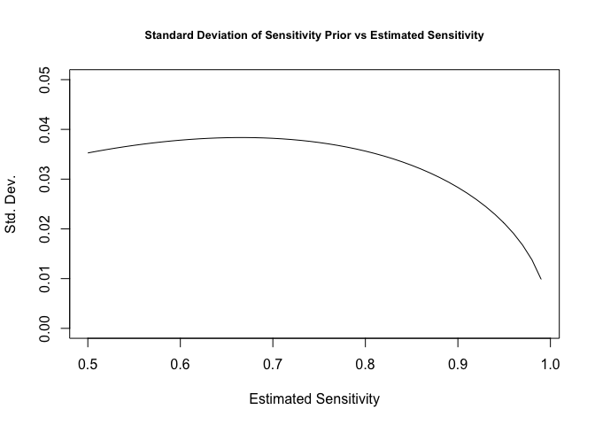
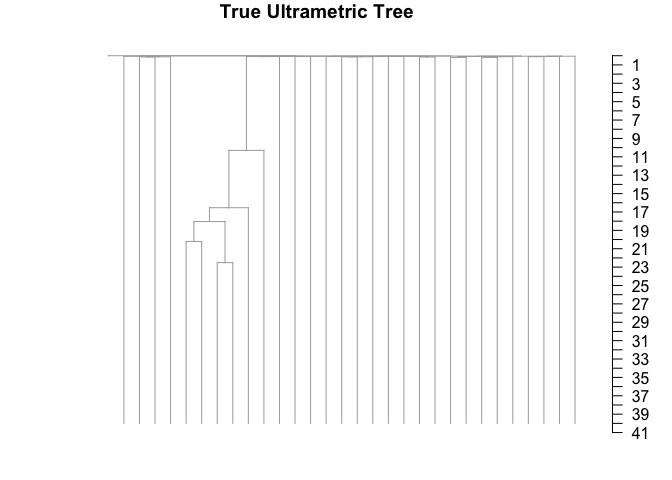

18/01/2021

<!-- README.md is generated from README.Rmd. Please edit that file -->

|                                                              |
|--------------------------------------------------------------|
| title: "Introduction to rtreefit"                            |
| tput: rmarkdown::html\_vignette                              |
| scription: &gt;                                              |
| Introduction to how to fit ultrametric trees using rtreefit. |
| gnette: &gt;                                                 |
| %                                                            |
| VignetteEngine{knitr::rmarkdown}                             |
| sepackage\[utf8\]{inputenc}                                  |

Branch Timings and Per Driver Clade Mutation Rate
-------------------------------------------------

We consider a rooted tree where each edge *i* consists of an observed mutation count *m*<sub>*i*</sub> and a true duration *t*<sub>*i*</sub>. We refer to a given edge and its child node interchangeably by the same label. Now let *D*(*i*) be the set of terminal nodes (tips) that descend from node *i* and let *A*(*i*) be its corresponding set of ancestral nodes excluding the root. We assume that each tip of the tree *k* has a known corresponding time *T*<sub>*k*</sub> (e.g. the post conception age in years of the patient at sampling of the cell) and so we therefore have the following constraint:

*T*<sub>*k*</sub> = ∑<sub>*i* ∈ *A*(*k*)</sub>*t*<sub>*i*</sub>

and

*T*<sub>*k*</sub> &gt; *t*<sub>*i*</sub> &gt; 0

We incorporate this constraint by performing the optimisation over the interior branches of the tree with reparameterised branch durations *x*<sub>*i*</sub> transformed to be in the range 0 &lt; *x*<sub>*i*</sub> &lt; 1. If *j* is an edge whose parent node is the root then:

*t*<sub>*j*</sub> = *x*<sub>*j*</sub>min(*T*<sub>*k*</sub> : *k* ∈ *D*(*j*))

For other interior edges, *i*, we have

*t*<sub>*i*</sub> = (min{*T*<sub>*k*</sub>:*k*∈*D*(*i*)}−∑<sub>*j* ∈ *A*(*i*)</sub>*t*<sub>*j*</sub>)*x*<sub>*i*</sub>

The duration of the terminal edges is fixed by the values of *t*<sub>*i*</sub> on the interior edges and the overall duration constraint:

*t*<sub>*i*</sub> = min{*T*<sub>*k*</sub>:*k*∈*D*(*i*)} − ∑<sub>*j* ∈ *A*(*i*)</sub>*t*<sub>*j*</sub>

We assume that there are *p* − 1 change points in the tree corresponding to the acquisition of driver mutations. This results in *p* mutation rates *λ*<sub>*j*</sub> applying throughout the tree where we allow at most one change point per branch and the initial ancestral (or wild type) rate is *λ*<sub>0</sub> and additional rate change points occur a fraction *α*<sub>*j*</sub> along branch *j* and descendent branches have the rate *λ*<sub>*j*</sub> unless there are additional change points in descendant branches. The effective rate on branches with a change point going from *λ*<sub>*l*</sub> to *λ*<sub>*j*</sub> is just the weighted average *α*<sub>*j*</sub>*λ*<sub>*l*</sub> + (1 − *α*<sub>*j*</sub>)*λ*<sub>*j*</sub> where we use a uniform unit interval prior for the *α*'s.

### Negative Binomial Model

We assume the underlying mutation process follows a Negative Binomial Distribution with the above piecewise constant driver specific mutation rates, the number of mutations accrued on branch *i* in time *t*<sub>*i*</sub> measured in years:

*M*<sub>*i*</sub> ∼ NB(*λ**t*<sub>*i*</sub>, *λ**t*<sub>*i*</sub>*ϕ*)

The number of observed mutations is:

*m*<sub>*i*</sub> ∼ Binomial(*M*<sub>*i*</sub>, *s*<sub>*i*</sub>)

Where we are using a per-branch estimated sensitivity *s*<sub>*i*</sub> that indirectly depends on the depth of sample and the number of samples sharing a branch (see ?). This is equivalent too:

*m*<sub>*i*</sub> ∼ NB(*λ**t*<sub>*i*</sub>*s*<sub>*i*</sub>, *λ**t*<sub>*i*</sub>*ϕ*)

with priors $\\frac{1}{\\phi} \\sim \\text{HalfNormal}(0,10)$, $\\lambda \\sim \\mathcal{N}(\\hat{\\lambda},0.25 \\hat{\\lambda}$ where $\\hat{\\lambda}$ is the naive estimation of a single rate *λ* as the per patient median of the ratio of the root to tip mutation count and the tip sampling age, and finally we use the weakly informative prior for the stick breaking fractions:
$$x\_i \\sim \\text{Beta}(\\alpha=\\frac{p\_i}{1-\\sum\_{j\\in A(i)}p\_j},\\beta=1)$$
 where the *p*<sub>*i*</sub> is an initial approximation of the duration of the branch length expressed as a fraction of the sampling time:
$$p\_i=\\text{min}\_{j\\in D(i)}\\left\\{\\frac{m\_j+1}{\\sum\_{k\\in A(j)}\\left(m\_k+1\\right)}\\right\\}$$

Note that the overdispersion parameter is rescaled so that it is comparable across branches with different mutation burden.

Note that we are using the following formulation of the Negative Binomial Distribution, which has the advantage that overdispersion parameter *ϕ* is invariant under binomial subsampling.

$$ \\text{NB}(y \\, | \\, \\mu, \\phi)  = \\binom{y + \\phi - 1}{y} \\,
\\left( \\frac{\\mu}{\\mu+\\phi} \\right)^{\\!y} \\, \\left(
\\frac{\\phi}{\\mu+\\phi} \\right)^{\\!\\phi} $$

and

$$ \\mathbb{E}\[Y\] = \\mu \\ \\ \\
\\text{ and } \\ \\ \\ \\text{Var}\[Y\] = \\mu + \\frac{\\mu^2}{\\phi}
$$

### Poisson Model

Here we assume the underlying mutation process follows a Poisson Distribution again with the above piecewise constant driver specific mutation rates, the number of observed mutations accrued on branch *i* in time *t*<sub>*i*</sub> measured in years:

*m*<sub>*i*</sub> ∼ Poisson(*λ**t*<sub>*i*</sub>*S*<sub>*i*</sub>)

where

$$ S\_i \\sim \\text{Beta}(\\alpha=c,\\beta=c\\frac{1-s\_i}{s\_i})$$

Where we have chosen the concentration parameter *c* = 100. This reflects only modest uncertainty in our estimates in sensitivity and also allows the model to mitigate larger than expected variability in the branch lengths. In other respects the priors are the same as for the Negative Binomial Model.

``` r
x=seq(0.5,0.99,0.01)
plot(x,sqrt(sapply(x,function(x) {a=100;b=100*(1-x)/x;a*b/(((a+b)**2)*(a+b+1))})),xlab="Estimated Sensitivity",ylab="Std. Dev.",ylim=c(0,0.05),type="l",main="Standard Deviation of Sensitivity Prior vs Estimated Sensitivity",cex.main=0.8)
```



Examples. First lets simulate a tree using rsimpop.

``` r
library("rtreefit")## Loads rsimpop as well
testing=run_neutral_sim(0.1,1/365,nyears=5)
#> n_sim_days: 1825
#> b_stop_if_empty: 0
#> b_stop_at_pop_size: 1
#> maxt: 0
#> driver_rate_per_cell_per_day: 0
#> MAX_EVENTS= 3650 
#> MAX_SIZE= 300003 
#> n_sim_days: 1825
#> b_stop_if_empty: 0
#> b_stop_at_pop_size: 0
#> maxt: 124.036913232919
#> driver_rate_per_cell_per_day: 0
#> MAX_EVENTS= 3650 
#> MAX_SIZE= 300003
st=get_subsampled_tree(testing,30)
#> Starting checking the validity of tmp...
#> Found number of tips: n = 31 
#> Found number of nodes: m = 30 
#> Done.
st=get_elapsed_time_tree(st,mutrateperdivision = 0,backgroundrate = 25/365,odf=1)
plot_tree(st)
```



    #> 
    #> Phylogenetic tree with 31 tips and 30 internal nodes.
    #> 
    #> Tip labels:
    #>  s1, s2, s3, s4, s5, s6, ...
    #> 
    #> Rooted; includes branch lengths.
    st$agedf=data.frame(tip.label=sprintf("s%d",1:31),age=c(1e-6,rep(5,30)))
    res=fit_tree(tree=st,switch_nodes = c(),xcross = c(),niter = 10000,model = "poisson_tree",early_growth_model_on = 0.0)
    #> Warning in fit_tree(tree = st, switch_nodes = c(), xcross = c(), niter =
    #> 10000, : No sensitivity supplied: assuming 99%
    #> Median lambda estimate=24.24
    #> Error in new_CppObject_xp(fields$.module, fields$.pointer, ...) : 
    #>   Exception: variable does not exist; processing stage=data initialization; variable name=alpha; base type=vector_d  (in 'model_poisson_tree' at line 106)
    #> failed to create the sampler; sampling not done
    #> Stan model 'poisson_tree' does not contain samples.
    print(res$lambda)
    #> $mean
    #> NULL
    #> 
    #> $sd
    #> NULL
    #> 
    #> $lb
    #> NULL
    #> 
    #> $ub
    #> NULL
    #> 
    #> $median
    #> NULL
