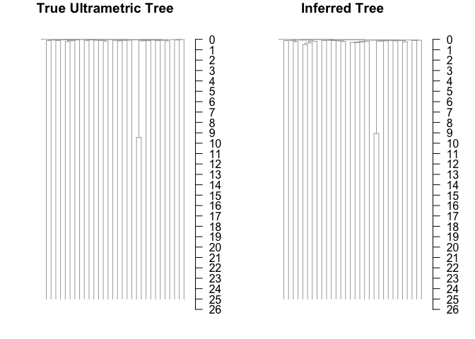

09/07/2021

<!-- README.md is generated from README.Rmd. Please edit that file -->

|                                                              |
|--------------------------------------------------------------|
| title: "Introduction to rtreefit"                            |
| tput: rmarkdown::html\_vignette                              |
| scription: &gt;                                              |
| Introduction to how to fit ultrametric trees using rtreefit. |
| gnette: &gt;                                                 |
| %                                                            |
| VignetteEngine{knitr::rmarkdown}                             |
| sepackage\[utf8\]{inputenc}                                  |

Branch Timings and Per Driver Clade Mutation Rate
-------------------------------------------------

We consider a rooted tree where each edge *i* consists of an observed mutation count *m*<sub>*i*</sub> and a true duration *t*<sub>*i*</sub>. We refer to a given edge and its child node interchangeably by the same label. Now let *D*(*i*) be the set of terminal nodes (tips) that descend from node *i* and let *A*(*i*) be its corresponding set of ancestral nodes excluding the root. We assume that each tip of the tree *k* has a known corresponding time *T*<sub>*k*</sub> (e.g. the post conception age in years of the patient at sampling of the cell) and so we therefore have the following constraint:

*T*<sub>*k*</sub> = ∑<sub>*i* ∈ *A*(*k*)</sub>*t*<sub>*i*</sub>

and

*T*<sub>*k*</sub> &gt; *t*<sub>*i*</sub> &gt; 0

We incorporate this constraint by performing the optimisation over the interior branches of the tree with reparameterised branch durations *x*<sub>*i*</sub> transformed to be in the range 0 &lt; *x*<sub>*i*</sub> &lt; 1. If *j* is an edge whose parent node is the root then:

*t*<sub>*j*</sub> = *x*<sub>*j*</sub>min(*T*<sub>*k*</sub> : *k* ∈ *D*(*j*))

For other interior edges, *i*, we have

*t*<sub>*i*</sub> = (min{*T*<sub>*k*</sub>:*k*∈*D*(*i*)}−∑<sub>*j* ∈ *A*(*i*)</sub>*t*<sub>*j*</sub>)*x*<sub>*i*</sub>

The duration of the terminal edges is fixed by the values of *t*<sub>*i*</sub> on the interior edges and the overall duration constraint:

*t*<sub>*i*</sub> = min{*T*<sub>*k*</sub>:*k*∈*D*(*i*)} − ∑<sub>*j* ∈ *A*(*i*)</sub>*t*<sub>*j*</sub>

We assume that there are *p* − 1 change points in the tree corresponding to the acquisition of driver mutations. This results in *p* mutation rates *λ*<sub>*j*</sub> applying throughout the tree where we allow at most one change point per branch and the initial ancestral (or wild type) rate is *λ*<sub>0</sub> and additional rate change points occur a fraction *α*<sub>*j*</sub> along branch *j* and descendent branches have the rate *λ*<sub>*j*</sub> unless there are additional change points in descendant branches. The effective rate on branches with a change point going from *λ*<sub>*l*</sub> to *λ*<sub>*j*</sub> is just the weighted average *α*<sub>*j*</sub>*λ*<sub>*l*</sub> + (1 − *α*<sub>*j*</sub>)*λ*<sub>*j*</sub> where we use a uniform unit interval prior for the *α*'s.

### Negative Binomial Model

We assume the underlying mutation process follows a Negative Binomial Distribution with the above piecewise constant driver specific mutation rates, the number of mutations accrued on branch *i* in time *t*<sub>*i*</sub> measured in years:

*M*<sub>*i*</sub> ∼ NB(*λ**t*<sub>*i*</sub>, *λ**t*<sub>*i*</sub>*ϕ*)

The number of observed mutations is:

*m*<sub>*i*</sub> ∼ Binomial(*M*<sub>*i*</sub>, *s*<sub>*i*</sub>)

Where we are using a per-branch estimated sensitivity *s*<sub>*i*</sub> that indirectly depends on the depth of sample and the number of samples sharing a branch (see ?). This is equivalent too:

*m*<sub>*i*</sub> ∼ NB(*λ**t*<sub>*i*</sub>*s*<sub>*i*</sub>, *λ**t*<sub>*i*</sub>*ϕ*)

with priors $\\frac{1}{\\phi} \\sim \\text{HalfNormal}(0,10)$, $\\lambda \\sim \\mathcal{N}(\\hat{\\lambda},0.25 \\hat{\\lambda})$ where $\\hat{\\lambda}$ is the naive estimation of a single rate *λ* as the per patient median of the ratio of the root to tip mutation count and the tip sampling age, and finally we use the weakly informative prior for the stick breaking fractions:
$$x\_i \\sim \\text{Beta}(\\alpha=\\frac{p\_i}{1-\\sum\_{j\\in A(i)}p\_j},\\beta=1)$$
 where the *p*<sub>*i*</sub> is an initial approximation of the duration of the branch length expressed as a fraction of the sampling time:
$$p\_i=\\text{min}\_{j\\in D(i)}\\left\\{\\frac{m\_j+1}{\\sum\_{k\\in A(j)}\\left(m\_k+1\\right)}\\right\\}$$

Note that the overdispersion parameter is rescaled so that it is comparable across branches with different mutation burden.

Note that we are using the following formulation of the Negative Binomial Distribution, which has the advantage that overdispersion parameter *ϕ* is invariant under binomial subsampling.

$$ \\text{NB}(y \\, | \\, \\mu, \\phi)  = \\binom{y + \\phi - 1}{y} \\,
\\left( \\frac{\\mu}{\\mu+\\phi} \\right)^{\\!y} \\, \\left(
\\frac{\\phi}{\\mu+\\phi} \\right)^{\\!\\phi} $$

and

$$ \\mathbb{E}\[Y\] = \\mu \\ \\ \\
\\text{ and } \\ \\ \\ \\text{Var}\[Y\] = \\mu + \\frac{\\mu^2}{\\phi}
$$

### Poisson Model

Here we assume the underlying mutation process follows a Poisson Distribution again with the above piecewise constant driver specific mutation rates, the number of observed mutations accrued on branch *i* in time *t*<sub>*i*</sub> measured in years:

*m*<sub>*i*</sub> ∼ Poisson(*λ**t*<sub>*i*</sub>*S*<sub>*i*</sub>)

where

$$ S\_i \\sim \\text{Beta}(\\alpha=c,\\beta=c\\frac{1-s\_i}{s\_i})$$

Where we have chosen the concentration parameter *c* = 100. This reflects only modest uncertainty in our estimates in sensitivity and also allows the model to mitigate larger than expected variability in the branch lengths. In other respects the priors are the same as for the Negative Binomial Model.

### Examples

Neutral Case. One Rate
----------------------

First lets simulate a neutral tree using rsimpop and fit the tree..

``` r
library("rtreefit")## Loads rsimpop as well
NYEARS=25
RATE=18
get_agedf_from_sim=function(simtree){
  st=get_elapsed_time_tree(simtree)## Gets "Real Time" ultrametric tree
  nh=nodeHeights(st)
  out=data.frame(tip.label=st$tip.label,age=nh[match(1:length(st$tip.label),st$edge[,2]),2]/365)
  out$age=ifelse(out$age<1e-6,1e-6,out$age)
  out
}
testing=run_neutral_sim(0.1,1/365,nyears=NYEARS)
#> n_sim_days: 9125
#> b_stop_if_empty: 0
#> b_stop_at_pop_size: 1
#> maxt: 0
#> driver_rate_per_cell_per_day: 0
#> MAX_EVENTS= 18250 
#> MAX_SIZE= 300003 
#> n_sim_days: 9125
#> b_stop_if_empty: 0
#> b_stop_at_pop_size: 0
#> maxt: 133.186269064628
#> driver_rate_per_cell_per_day: 0
#> MAX_EVENTS= 18250 
#> MAX_SIZE= 300003
st=get_subsampled_tree(testing,30)
#> Starting checking the validity of tmp...
#> Found number of tips: n = 31 
#> Found number of nodes: m = 30 
#> Done.
st=get_elapsed_time_tree(st,mutrateperdivision = 0,backgroundrate = RATE/365,odf=1)

plot_tree(st)
```


    #> 
    #> Phylogenetic tree with 31 tips and 30 internal nodes.
    #> 
    #> Tip labels:
    #>  s1, s2, s3, s4, s5, s6, ...
    #> 
    #> Rooted; includes branch lengths.
    st$agedf=get_agedf_from_sim(st)
    res=fit_tree(tree=st,switch_nodes = c(),xcross = c(),niter = 10000,model = "poisson_tree",early_growth_model_on = 0.0)
    #> Warning in fit_tree(tree = st, switch_nodes = c(), xcross = c(), niter =
    #> 10000, : No sensitivity supplied: assuming 99%
    #> Median lambda estimate=18.30
    print(res$lambda)
    #> $mean
    #> [1] 18.37559
    #> 
    #> $sd
    #> [1] 0.1715528
    #> 
    #> $lb
    #> [1] 18.04111
    #> 
    #> $ub
    #> [1] 18.72024
    #> 
    #> $median
    #> [1] 18.37409
    par(mfcol=c(1,2))
    ut=get_elapsed_time_tree(st)
    ut$edge.length=ut$edge.length/365
    plot_tree(ut,cex.label = 0);title("True Ultrametric Tree")
    #> 
    #> Phylogenetic tree with 31 tips and 30 internal nodes.
    #> 
    #> Tip labels:
    #>  s1, s2, s3, s4, s5, s6, ...
    #> 
    #> Rooted; includes branch lengths.
    plot_tree(res$ultratree,cex.label = 0);title("Inferred Tree")
    #> 
    #> Phylogenetic tree with 31 tips and 30 internal nodes.
    #> 
    #> Tip labels:
    #>  s1, s2, s3, s4, s5, s6, ...
    #> 
    #> Rooted; includes branch lengths.



Selection Case. Two fitted rates - both the same..
--------------------------------------------------

``` r
NYEARS=40
RATE=15
selsim=run_selection_sim(0.1,1/365,target_pop_size = 1e5,nyears_driver_acquisition = 5,nyears = NYEARS,fitness=0.3,minprop = 0.05)
#> n_sim_days: 1825
#> b_stop_if_empty: 0
#> b_stop_at_pop_size: 1
#> maxt: 0
#> driver_rate_per_cell_per_day: 0
#> MAX_EVENTS= 3650 
#> MAX_SIZE= 300003 
#> n_sim_days: 1825
#> b_stop_if_empty: 0
#> b_stop_at_pop_size: 0
#> maxt: 109.958137588241
#> driver_rate_per_cell_per_day: 0
#> MAX_EVENTS= 3650 
#> MAX_SIZE= 300003 
#> No driver found: tries= 0 
#>    val population fitness id driver1
#> 1    0          1     0.0  0       0
#> 2    1      99976     0.0  0       0
#> 21   1          1     0.3  1       1
#> n_sim_days: 14600
#> b_stop_if_empty: 1
#> b_stop_at_pop_size: 0
#> maxt: 1825.00193260129
#> driver_rate_per_cell_per_day: 0
#> MAX_EVENTS= 29200 
#> MAX_SIZE= 300003
st=get_subsampled_tree(selsim,30)
#> Starting checking the validity of tmp...
#> Found number of tips: n = 31 
#> Found number of nodes: m = 30 
#> Done.
st=get_elapsed_time_tree(st,mutrateperdivision = 0,backgroundrate = RATE/365,odf=1)
st$agedf=get_agedf_from_sim(st)
node=st$events$node[which(st$events$driverid==1)]
res=fit_tree(tree=st,switch_nodes = node,xcross = c(),niter = 10000,model = "poisson_tree",early_growth_model_on = 0.0)
#> Warning in fit_tree(tree = st, switch_nodes = node, xcross = c(), niter =
#> 10000, : No sensitivity supplied: assuming 99%
#> Median lambda estimate=15.10
print(res$lambda)
#> $mean
#> lambda[1] lambda[2] 
#>  15.23813  15.04098 
#> 
#> $sd
#> lambda[1] lambda[2] 
#> 0.1374329 0.4578260 
#> 
#> $lb
#> lambda[1] lambda[2] 
#>  14.97016  14.17920 
#> 
#> $ub
#> lambda[1] lambda[2] 
#>  15.50640  15.95628 
#> 
#> $median
#> lambda[1] lambda[2] 
#>  15.23717  15.02817
ut=get_elapsed_time_tree(st)
ut$edge.length=ut$edge.length/365
par(mfcol=c(1,2))
plot_tree(ut,cex.label = 0);title("True Ultrametric Tree")
#> 
#> Phylogenetic tree with 31 tips and 30 internal nodes.
#> 
#> Tip labels:
#>  s1, s2, s3, s4, s5, s6, ...
#> 
#> Rooted; includes branch lengths.
plot_tree(res$ultratree,cex.label = 0);title("Inferred Tree")
#> 
#> Phylogenetic tree with 31 tips and 30 internal nodes.
#> 
#> Tip labels:
#>  s1, s2, s3, s4, s5, s6, ...
#> 
#> Rooted; includes branch lengths.
```


